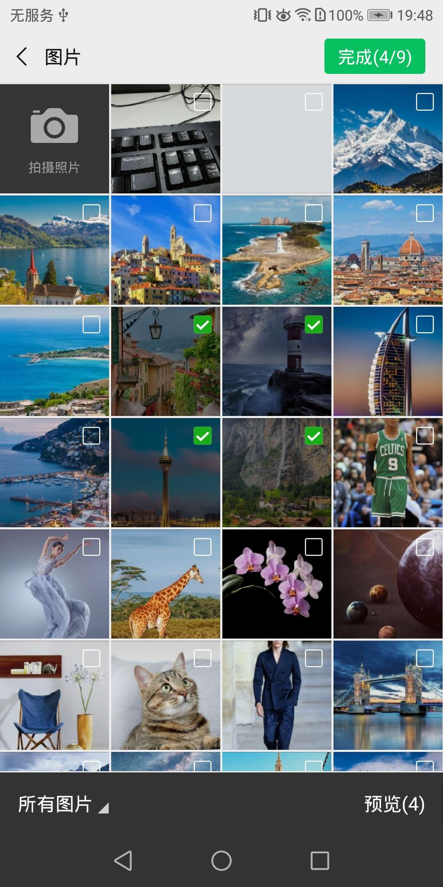
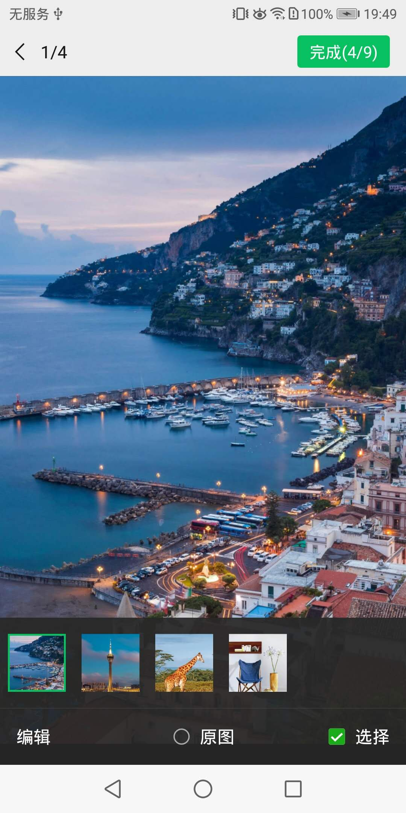

## 图像接口

#### 拍照或从手机相册中选图接口
```js
wx.chooseImage({
count: 1, // 默认9
sizeType: ['original', 'compressed'], // 可以指定是原图还是压缩图，默认二者都有
sourceType: ['album', 'camera'], // 可以指定来源是相册还是相机，默认二者都有
success: function (res) {
var localIds = res.localIds; // 返回选定照片的本地ID列表，localId可以作为img标签的src属性显示图片
}
}); 
```  
例如: 从手机选择图片





#### 预览图片接口
```js
wx.previewImage({
current: '', // 当前显示图片的http链接
urls: [] // 需要预览的图片http链接列表
});
```

#### 上传图片接口
```js
wx.uploadImage({
localId: '', // 需要上传的图片的本地ID，由chooseImage接口获得
isShowProgressTips: 1, // 默认为1，显示进度提示
success: function (res) {
var serverId = res.serverId; // 返回图片的服务器端ID
}
});
```

#### 获取本地图片接口
```js
wx.getLocalImgData({
localId: '', // 图片的localID
success: function (res) {
var localData = res.localData; // localData是图片的base64数据，可以用img标签显示
}
});
```
备注：此接口仅在 iOS WKWebview 下提供，用于兼容 iOS WKWebview 不支持 localId 直接显示图片的问题。具体可参考《iOS网页开发适配指南》