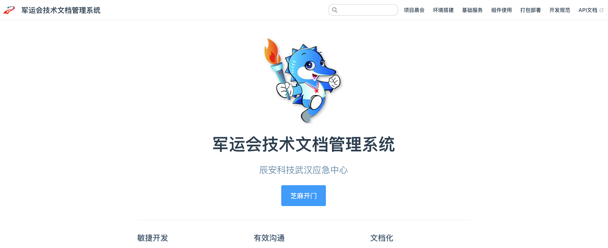

::: tip
介绍说明: title就是一级标题
:::

## 二级标题
1. 列表1
2. 列表1

### 三级标题
- 列表2
- 列表2

## 超链接
写法
``` md
[文件名](路径)
```
示例:  
[swaggerUI](https://mvs.gsafetyweixinsupport.cn:1080/swagger-ui/dist/#/)

## 图标
写法  
``` vue
<Badge text="xxx"/>
```
示例:  
<Badge text="hello"/>

## 表情
你在[这里](https://github.com/markdown-it/markdown-it-emoji/blob/master/lib/data/full.json)可以找到所有可用的表情列表。 
写法
```
:smiley:
```
效果  
:smiley:


## 图片
写法
``` md

``` 
示例: 
```md

```


## 表格
写法
```md
| 标题1      | 标题2      | 标题3  |
| -----------|:---------:| -----:|
| 行1列1     | 行1列2     | 行1列3 |
| 行2列1     | 行2列2     | 行3列3 |
| 行3列1     | 行3列2     | 行3列3 |
```
示例:
| Tables        | Are           | Cool  |
| ------------- |:-------------:| -----:|
| col 3 is      | right-aligned | $1600 |
| col 2 is      | centered      |   $12 |
| zebra stripes | are neat      |    $1 |


## 代码块
支持大量的编程语言，你需要做的只是在代码块的开始倒勾中附加一个有效的语言别名, 写法:
````
``` js {4}
export default {
  data () {
    return {
      msg: 'Highlighted!'
    }
  }
}
```
````
效果: 
``` js {4}
export default {
  data () {
    return {
      msg: 'Highlighted!'
    }
  }
}
```
其中{4}表示第四行高亮

## 附件
在assets目录下面的file文件夹, 下面存放各种类型的附件。
例如:
[军运会技术文档管理系统](../assets/file/军运会技术文档管理系统.pdf)

## 评论
<Valine></Valine>


